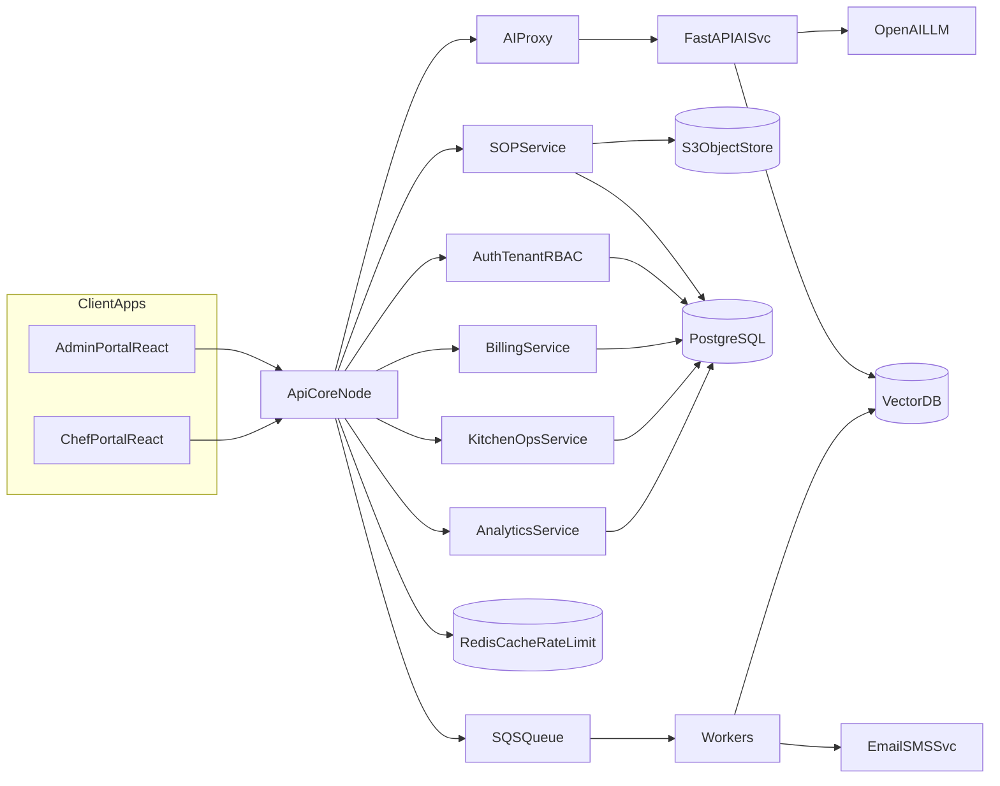

# System Architecture

## Multi-Tenant Security
- Tenant-bound JWT claims: `tenantId`, `role`, `planCode`.
- Every query filtered by `tenant_id`.
- SOP retrieval and embeddings always include tenant namespace.
- API rate-limits per tenant and per user.
